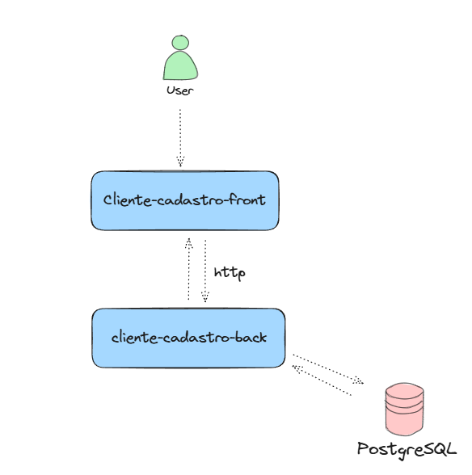

# Cliente Cadastro

Este projeto é uma aplicação Spring Boot para gerenciar clientes e seus telefones. A aplicação oferece uma API RESTful para criar e gerenciar clientes.



## Estrutura do Projeto

- **ClienteCadastroApplication**: Classe principal que inicia a aplicação Spring Boot.
- **ClienteController**: Controlador REST que lida com as requisições para gerenciar clientes.
- **ClienteDTO**: Objeto de transferência de dados para cliente.
- **TelefoneDTO**: Objeto de transferência de dados para telefone.
- **GlobalExceptionHandler**: Classe que trata exceções globais na aplicação.

## Configuração do Banco de Dados

O banco de dados utilizado é o PostgreSQL. As configurações do banco de dados estão no arquivo `application.properties`.

## Autenticação

A aplicação usa autenticação básica com credenciais configuradas no `application.properties` para proteger as APIs.

## Arquivos Importantes

- `application.properties`: Contém configurações da aplicação, como credenciais de banco de dados e configurações de segurança.
- `Dockerfile`: Arquivo para construir a imagem Docker da aplicação.
- `docker-compose.yml`: Arquivo Docker Compose para iniciar a aplicação junto com uma instância MySQL.
- Arquivos de configuração do Kubernetes (`deployment.yaml` e `service.yaml`).

## Como Executar a Aplicação

### Usando Docker

1. **Construa a imagem Docker**

   No diretório raiz do projeto, execute:

   ```sh
   docker build -t cliente-cadastro:latest .
   ```

2. **Inicie a aplicação usando Docker Compose**

   No diretório raiz do projeto, execute:

    ```sh
       docker-compose up
    ```

### Usando Kubernetes

Os arquivos do k8s precisam ser configurados com suas respectivas variaveis e informacoes, que variam 
de infra para infra, entao ele esta com placeholders que precisam ser alterados.

1. **Configuração dos Segredos**

    Antes de implantar no Kubernetes, crie segredos para armazenar as credenciais do banco de dados:

    ```sh
       kubectl create secret generic db-credentials --from-literal=username=seu_usuario_db --from-literal=password=sua_senha_db
    ```

2. **Implantação no Kubernetes**

    Aplique os arquivos de configuração do Kubernetes:

    ```sh
      kubectl apply -f deployment.yaml
      kubectl apply -f service.yaml
    ```

    Isso irá criar um Deployment e um Service no Kubernetes. O Service expõe a aplicação na porta 80 e direciona o tráfego para a porta 8080 nos pods da aplicação.